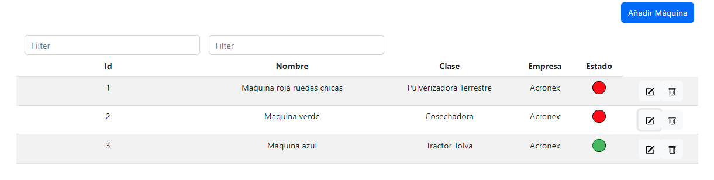

# BackEnd-App Api Django ACRONEX
Seguir los pasos para ejecutar el servidor
## Instalación de Python 
https://www.python.org/downloads/
## Inslación de NodeJs
https://nodejs.org/en/download/current/
## Abrir ventana de comandos en AcronexApi
<!--sec data-title="Comandos" data-id="OSX_Linux_whoami" data-collapse=true ces-->

    > cd AcronexApi
    

<!--endsec-->
<!--sec data-title="Comandos" data-id="OSX_Linux_whoami" data-collapse=true ces-->

    > pip install django
    

<!--endsec-->
<!--sec data-title="Comandos" data-id="OSX_Linux_whoami" data-collapse=true ces-->

    > pip install djangorestframework
    

<!--endsec-->
<!--sec data-title="Comandos" data-id="OSX_Linux_whoami" data-collapse=true ces-->

    > pip install django-cors-headers
    

<!--endsec-->

## Ejecución
<!--sec data-title="Comandos" data-id="OSX_Linux_whoami" data-collapse=true ces-->

    > python Manage.py runserver
    

<!--endsec-->
## Abrir en el navegador
[http://127.0.0.1:8000/machine](http://127.0.0.1:8000/machine)

# Yapa! Interfaz UI
Interfaz en React Js para probar Funciones GET, POST, PUT, DELETE.
<!--sec data-title="Comandos" data-id="OSX_Linux_whoami" data-collapse=true ces-->

    > cd ui
    

<!--endsec-->
# Instalacion

1- Instalar NodeJs -> https://nodejs.org/es/download/current/  **Importante:Última versión requerida** (nótese "current" (ultima version) en la dirección).

## Lanzar servidor local

<!--sec data-title="Comandos" data-id="OSX_Linux_whoami" data-collapse=true ces-->

    > npm start
    

<!--endsec-->

